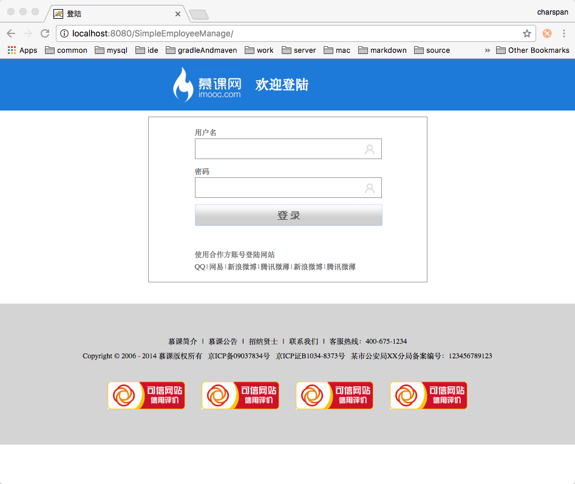
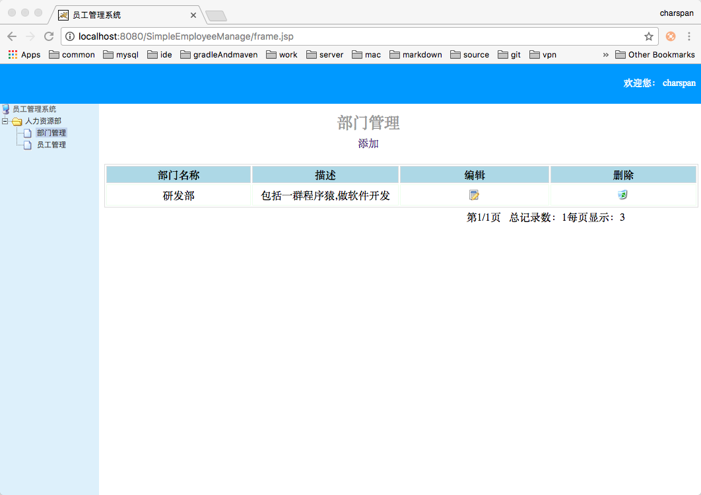
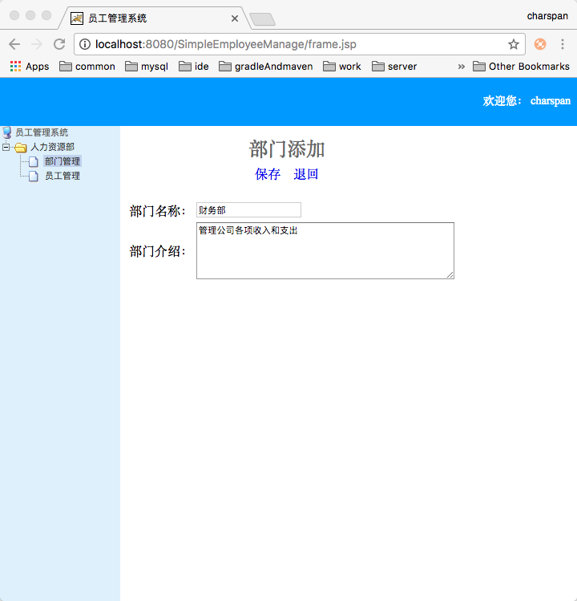
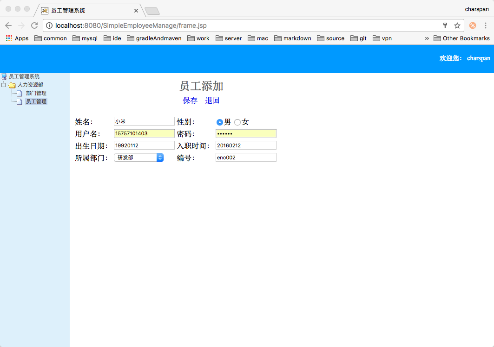

# 简单员工管理系统

## 项目介绍

1. 开发框架: struts2 + spring3 + hibernate3
2. 开发环境: eclipe + mysql5.7 + tomcat7
3. 项目功能: 部门管理(新增、删除、修改、查询)、员工管理(登录、新增、删除、修改、查询)
4. 存在bug: 1.任意员工登录即可操控整改后台，属于逻辑 bug 2.界面实在太丑需要美化，属于业务 bug
5. 项目未来计划: 1.修改逻辑 bug 将引入权限管理 2.运用前端框架优化界面显示 3.升级后台开发框架 4.用 maven 或者 gradle 管理项目

## 项目截图

### 登录页

### 主界面

### 部门列表&部门删除

### 添加部门

### 员工列表&员工删除

### 添加员工

